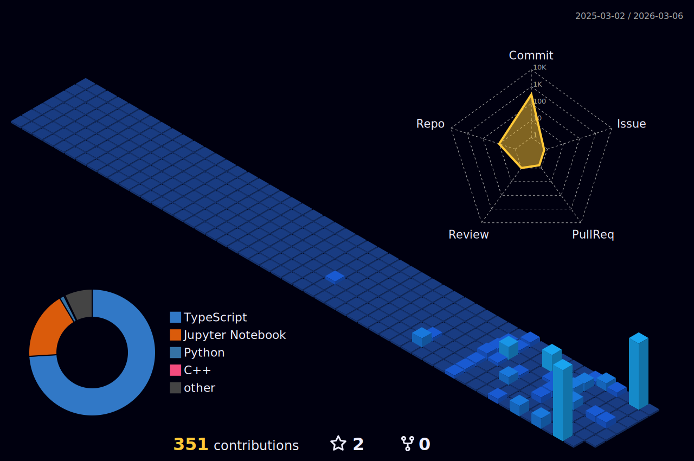

<!-- Header Banner -->


<!-- Coding Animation GIF -->
<p align="center">
  
</p>

<!-- Animated Typing -->
<p align="center">
  <a href="https://git.io/typing-svg"></a>
</p>

<!-- Social Media Badges -->
<p align="center">
  <a href="https://www.linkedin.com/in/p-kanisius-bagaskara-03b320384"></a>
  <a href="mailto:maxvy1212@gmail.com"></a>
  <a href="https://github.com/maxvyquincy9393"></a>
</p>

<!-- Profile Views Counter -->
<p align="center">
  
  
</p>

---

##  About Me

```python
class AIEngineer:
    def __init__(self):
        self.name = "P. Kanisius Bagaskara"
        self.role = "AI Engineer in Progress"
        self.location = "Jakarta, Indonesia"
        self.education = "Self-taught Developer"
        self.languages = ["Python", "C++", "Dart", "JavaScript"]
    
    def current_focus(self):
        return {
            "learning": [
                "Python Advanced & Data Structures",
                "NumPy & Vectorization",
                "Mathematics for AI (Linear Algebra, Calculus)",
                "Machine Learning Fundamentals"
            ],
            "building": [
                "F1 Analytics Dashboard",
                "ML Practice Projects",
                "AI Data Scraping Tools"
            ],
            "exploring": [
                "PyTorch & Deep Learning",
                "JAX/Flax for HPC",
                "Robotics & IoT Integration"
            ]
        }
    
    def ultimate_goal(self):
        return "Become a Professional AI Engineer with expertise in Robotics & IoT"

# Initialize
me = AIEngineer()
print(me.ultimate_goal())
```

<p align="center">
  
  
</p>

---

##  GitHub Analytics

<p align="center">
  
  
</p>

<p align="center">
  
</p>

---

##  Learning Journey

###  **Python & Core Programming**
-  Python Fundamentals (Variables, Loops, Functions)
-  Object-Oriented Programming (OOP)
-  Data Structures & Algorithms
-  Advanced Python (Decorators, Generators, Context Managers)
-  Design Patterns & Best Practices
-  Functional Programming Concepts

###  **Machine Learning & AI**
-  Supervised & Unsupervised Learning
-  Linear Regression & Classification
-  Neural Networks Basics
-  Deep Learning (CNN, RNN, Transformers)
-  Natural Language Processing (NLP)
-  Computer Vision & Image Processing

###  **Data Science Stack**
-  NumPy & Pandas for Data Manipulation
-  Matplotlib & Seaborn for Visualization
-  Statistical Analysis & Probability
-  Feature Engineering
-  Data Preprocessing & Cleaning
-  Exploratory Data Analysis (EDA)

###  **AI Engineering & Deployment**
-  Streamlit Dashboard Development
-  TensorFlow Lite Model Conversion
-  API Development with Flask/FastAPI
-  Docker & Containerization
-  MLOps & CI/CD for ML
-  Cloud Deployment (AWS/GCP)

###  **Tools & Technologies**
-  Git & GitHub for Version Control
-  VS Code & Jupyter Notebooks
-  Flutter for Mobile Development
-  Linux Command Line
-  Docker & Kubernetes Basics
-  Postman for API Testing

###  **AI Agents & LLMs**
-  Gemini API Integration
-  LangChain Framework
-  Prompt Engineering
-  RAG (Retrieval-Augmented Generation)
-  Vector Databases (Pinecone, Weaviate)
-  Agent Orchestration

**Legend:**  Completed |  In Progress |  Planned

---

##  Featured Projects

###  **F1 2025 Analytics Dashboard**
[](https://github.com/maxvyquincy9393/hub)


**Professional-grade analytics platform** for Formula 1 2025 season with real-time telemetry analysis, race strategy insights, and ML-powered predictions.

**Features:**
-  Season Overview with Driver & Constructor standings
-  Race Center with telemetry comparison
-  AI Predictions using Random Forest Regression
-  Qualifying Deep Dive & Sector Analysis
-  Teammate Battles & Statistical Comparisons

**Tech Stack:** `Python` `Streamlit` `Pandas` `Plotly` `FastF1` `Scikit-Learn`

---

###  **Machine Learning Practice**
[](https://github.com/maxvyquincy9393/ipynb_Machine_learning_practice)


**Hands-on ML project** focused on building solid fundamentals with clean experimentation and reproducible results.

**Features:**
-  Linear Algebra for ML foundations
-  Linear Regression implementations
-  Data visualization & EDA
-  Model training & evaluation

**Tech Stack:** `Python` `NumPy` `Pandas` `Matplotlib` `Scikit-Learn`

---

###  **House Price Prediction**
[](https://github.com/maxvyquincy9393/house_prediction)


**ML project** for predicting house prices using regression techniques and feature engineering.

**Tech Stack:** `Python` `Pandas` `Scikit-Learn` `Jupyter`

---

###  **AI Data Scraping**
[](https://github.com/maxvyquincy9393/AI_Data_Scraping)


**Data collection pipeline** using AI-assisted web scraping for building training datasets.

**Tech Stack:** `Python` `BeautifulSoup` `Requests` `Pandas`

---

###  **Algorithm & Data Structures (C++)**
[](https://github.com/maxvyquincy9393/tugas_uas_algoritma)


**University coursework** covering fundamental algorithms and data structures in C++.

**Tech Stack:** `C++`

---

###  **More Projects Coming Soon!**

I'm constantly building new projects to improve my AI engineering skills. Stay tuned for:
-  **Image Classification App** - CNN-based image classifier
-  **Text Summarizer** - NLP-powered document summarization
-  **Robotics AI Integration** - AI models for IoT devices

**Want to collaborate?** Feel free to reach out!

---

##  Tech Stack & Tools

### **Programming Languages**


### **AI/ML Frameworks & Libraries**


### **Data Science & Analytics**


### **Development Tools**


### **Mobile & Web Development**


### **AI Services & APIs**


---

##  Contribution Activity

[](https://github.com/maxvyquincy9393)

---

##  GitHub Achievements

[](https://github.com/maxvyquincy9393)

---

##  3-Year AI Engineering Roadmap

<p align="center">
  
  
</p>

---

###  
**Focus:** Python Advanced → Data Structures → NumPy → Math AI → ML Dasar → PyTorch Dasar

<details>
<summary><b>PHASE 1: Python Advanced + Data Structure (Nov 2025 – Feb 2026)</b></summary>

**Subskills:**
| Category | Topics |
|----------|--------|
| **OOP Mastery** | Class, Encapsulation, Inheritance, Polymorphism, Magic methods (`__getitem__`, `__iter__`, `__len__`, `__call__`), Composition |
| **Data Structures** | List/dict/set internal mechanics, Stack & Queue, Linked List, Binary Tree (insert, delete, traversal), Graph (adj list, BFS/DFS) |

**Output:**
- 
-  (save/load txt/json)

</details>

<details>
<summary><b>PHASE 2: NumPy Core + Vectorization (Jan – Mar 2026)</b></summary>

**Subskills:**
- Ndarray operations
- Broadcasting (priority)
- Vectorization (no loops!)
- Matrix operations
- Memory layout (dtype, strides, contiguous vs non-contiguous)

**Output:**
-  (tanpa loop)
-  (pure NumPy)

</details>

<details>
<summary><b>PHASE 3: Mathematics for AI (Feb – Apr 2026)</b></summary>

**Subskills:**
| Category | Topics |
|----------|--------|
| **Linear Algebra** | Vectors, Matrices, Transpose, Dot product, Norm, Orthogonality |
| **Calculus** | Derivative dasar, Chain rule, Gradient Wx + b |
| **Statistics** | Mean, Variance, Normal distribution, Z-score scaling |

**Output:**
- 
-  (fully-connected layer)

</details>

<details>
<summary><b>PHASE 4: Fundamental Machine Learning (Apr – Aug 2026)</b></summary>

**Subskills:**
| Category | Topics |
|----------|--------|
| **Preprocessing** | Feature scaling, Train/test split |
| **Classic ML** | KNN, Linear Regression, Logistic Regression, SVM, Decision Tree, Random Forest, Naive Bayes |
| **Metrics** | Accuracy, Precision, Recall, F1, ROC-AUC |

**Output:**
- 
-  (preprocessing → train → evaluate → infer)

</details>

<details>
<summary><b>PHASE 5: PyTorch Foundation (Aug – Dec 2026)</b></summary>

**Subskills:**
- Tensor + autograd
- GPU basics (API learning)
- nn.Module
- Optimizers & Loss functions
- Custom Dataset & DataLoader
- Proper Training loop

**Output:**
- 
- 
- 

</details>

---

### 
**Focus:** Deep Learning Engineering → Transformer → JAX/Flax HPC

<details>
<summary><b>PHASE 6: Deep Learning Engineering (Jan – Apr 2027)</b></summary>

**Subskills:**
- LayerNorm, Dropout, Residual connection
- Optimizers (SGD, Adam, AdamW)
- Mixed precision, Gradient clipping
- Debugging NaN / exploding gradient

**Output:**
- 
- -success?style=flat-square)

</details>

<details>
<summary><b>PHASE 7: Transformer From Scratch (Apr – Aug 2027)</b></summary>

**Subskills:**
- Self-attention (mathematics & implementation)
- Scaled dot product
- Multi-head attention
- Positional encoding
- Feedforward block
- LayerNorm
- Transformer Training loop

**Output:**
- 
- 

</details>

<details>
<summary><b>PHASE 8: JAX/Flax + HPC (Aug – Dec 2027)</b></summary>

**Subskills:**
| Category | Topics |
|----------|--------|
| **JAX Core** | jax.numpy (jnp), jit, grad, vmap, scan |
| **Flax** | Linen, Optax optimizer |
| **XLA** | HLO, fusion, memory optimization |
| **Distributed** | Profiling FLOPS/latency, Sharding (pjit, GSPMD), TPU training |

**Output:**
- 
- 
- 
-  (Colab/Kaggle)
- 

</details>

---

### 
**Focus:** ML Systems → Distributed AI → Portfolio → Interview Prep

<details>
<summary><b>PHASE 9: ML Systems Engineering (Jan – Apr 2028)</b></summary>

**Subskills:**
- Model serving (FastAPI/gRPC)
- Inference batching & Caching
- Quantization (FP16/FP8/INT8)
- ONNX export & deployment

**Output:**
- 

</details>

<details>
<summary><b>PHASE 10: Distributed AI Engineering (Apr – Jul 2028)</b></summary>

**Subskills:**
- Data parallel, Model parallel, Pipeline parallel
- Checkpoint sharding
- Gradient accumulation
- Activation checkpointing
- Multi-host TPU training

**Output:**
-  (multi-core)

</details>

<details>
<summary><b>PHASE 11: Portfolio & Interview Prep (Jul – Oct 2028)</b></summary>

**Subskills:**
| Category | Topics |
|----------|--------|
| **DSA** | Graph, Tree, DP dasar |
| **System Design** | ML system design, Optimization |
| **Behavioral** | STAR method |

**5 Big Portfolio Projects:**
1. -00D9FF?style=flat-square)
2. -00D9FF?style=flat-square)
3. 
4. 
5. 

</details>

---

##  3D Contribution Graph



---

##  Connect With Me

###  **Let's Build Something Amazing Together!**

I'm always open to collaborating on AI/ML projects, discussing new technologies, or just having a chat about artificial intelligence and its possibilities.

<p align="center">
  <a href="https://www.linkedin.com/in/p-kanisius-bagaskara-03b320384"></a>
  <a href="mailto:maxvy1212@gmail.com"></a>
  <a href="https://github.com/maxvyquincy9393"></a>
</p>

###  **Open for Opportunities**
<p align="center">
  <a href="mailto:maxvy1212@gmail.com"></a>
</p>

---

###  **Random Dev Quote**


---

###  **Weekly Development Breakdown**
```text
Python       12 hrs 30 mins  ████████████░░░░░░░░░  60%
Dart          4 hrs 15 mins  ████░░░░░░░░░░░░░░░░░  20%
JavaScript    2 hrs 30 mins  ██░░░░░░░░░░░░░░░░░░░  12%
C++           1 hr 45 mins   ██░░░░░░░░░░░░░░░░░░░   8%
```

---

<p align="center">
  <strong>⭐ From <a href="https://github.com/maxvyquincy9393">P. Kanisius Bagaskara</a> with ❤️</strong><br/>
  <em>"Building the future of AI for Robotics & IoT"</em>
</p>

<!-- Footer -->

